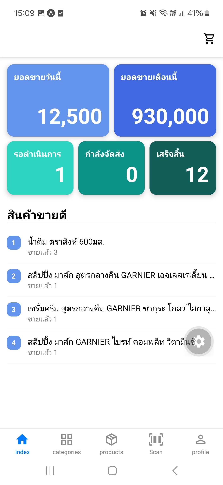

# Shiro — User Guide

This guide walks through using the Shiro app as an end user. Screens are in Thai; English labels are given alongside each one for reference.

> 📸 Screenshots: placeholders are marked below as ``. Drop your images into a `docs/screenshots/` folder using the same filenames and they'll appear inline.

## Contents

- [Getting started](#getting-started)
- [Home tab (Dashboard)](#home-tab-dashboard)
- [Browsing categories & products](#browsing-categories--products)
- [Scanning a barcode](#scanning-a-barcode)
- [Cart & checkout](#cart--checkout)
- [My Orders](#my-orders)
- [Saved addresses](#saved-addresses)
- [Payments](#payments)
- [Profile](#profile)
- [Roles & permissions](#roles--permissions)

---

## Getting started

1. Open the app. If you're not signed in, you'll land on the **Login** (เข้าสู่ระบบ) screen.
2. Enter your username and password and tap **เข้าสู่ระบบ** (Log in).
3. No account yet? Tap **ยังไม่มีบัญชี? สมัครสมาชิก** (Don't have an account? Register) to create one from the **Register** (สมัครสมาชิก) screen.

Once signed in, you land on the main tab bar with five tabs: **Home**, **รายการสินค้า** (Products), **แสกนสินค้า** (Scan), **ประวัติ** (Orders), and **โปรไฟล์** (Profile).

---

## Home tab (Dashboard)

What you see here depends on your role:

- **Staff / customers** see a blank home screen (nothing to configure yet).
- **Owners, super-admins, and order managers** see a **Dashboard** with:
    - Today's sales and this month's sales totals
    - Pending / shipping / completed order counts (tap "รอดำเนินการ" / Pending to jump to the Orders list)
    - A "สินค้าขายดี" (Best sellers) list — tap any product to open its detail page
- **Staff-level roles** (product managers, order managers, staff, finance managers, owners, super-admins) also see a "ฐานข้อมูล" (Database) management menu on this tab, with links that adapt to your role: ผู้ใช้งาน/Users (owners/super-admins), หมวดหมู่สินค้า/Categories (all staff-level roles), รายการสินค้า/Products (product managers), คำสั่งซื้อ/Orders (order managers/staff), and ประวัติการชำระเงิน/Payment history (finance managers). This menu used to live under Profile — it's now on Home.

---

## Browsing categories & products

- **รายการสินค้า (Products tab)**: a scrollable grid of all products with name and price. If you arrived via a category, a filter chip shows at the top — tap **ล้างตัวกรอง** (Clear filter) to see everything again.
- Tap any product card to open its **product detail page**, showing name, price, and barcode(s).

From a product's detail page you can:

- Adjust quantity with the stepper and tap **เพิ่มลงในตะกร้า** (Add to cart) / **อัปเดตตะกร้า** (Update cart) / **ลบออกจากตะกร้า** (Remove from cart).
- Tap the cart icon (top right) to jump straight to your cart.

---

## Scanning a barcode

Open the **แสกนสินค้า (Scan)** tab, grant camera access if prompted, and point the camera at a product barcode.

- **Found**: you're taken straight to that product's detail page.
- **Not found**: you'll see an alert. Staff with product-management permission are offered a shortcut to create a new product pre-filled with the scanned barcode.

---

## Cart & checkout

1. Tap the cart icon (visible in the header on most tabs) to open your **cart**.
2. Review items and the total, then tap **ยืนยันคำสั่งซื้อ** (Confirm order) to lock in current prices.
3. Locked prices are held for a limited time (shown as a countdown, e.g. `4:59`). If it runs out before you finish, tap **ล็อกราคาใหม่** (Re-lock prices) to refresh it.
4. Choose or add a shipping address in the **Shipping address** section.
5. Tap **ยืนยันคำสั่งซื้อ** (Confirm order) again to place the order — you'll be taken to the new order's detail page.

An empty cart shows a prompt to browse products instead.

---

## My Orders

Access via the **ประวัติ (Orders) tab** in the bottom nav, or via **Profile → คำสั่งซื้อของฉัน** (My orders).

- Filter by status: All / Created (อยู่ระหว่างดำเนินการ) / Shipped (จัดส่งแล้ว) / Completed (เสร็จสมบูรณ์) / Cancelled (ยกเลิกแล้ว).
- Tap an order to see its full detail: items, total, timestamps, and (depending on your role) status actions or payment entry.

On an order's detail screen, staff-level roles may be able to:

- Edit line items (only while the order is still "Created")
- Mark it **shipped**, **completed**, or **cancelled**
- Record or cancel payments against it (see [Payments](#payments))

---

## Saved addresses

Access via **Profile → สถานที่ที่บันทึกไว้** (Saved addresses).

- View your saved shipping addresses.
- Tap **+** in the header to add a new one.
- Tap the pencil icon to edit an address, or the trash icon to delete it (with a confirmation prompt).

---

## Payments

Access via **Profile → การชำระเงินของฉัน / การชำระเงินทั้งหมด** (My payments / All payments — the label and scope depend on your role).

- Regular users see only their own payments.
- Finance managers see every payment across all orders.
- Each entry shows the customer's username, the amount, method (เงินสด/Cash or โอนจ่าย/Bank transfer), and links back to its order. Cancelled payments are shown greyed out.

---

## Profile

Access via the **โปรไฟล์ (Profile)** tab. Shows your username, user ID, and role badges, plus a menu that adapts to your permissions:

- **เฉพาะพนักงาน (Staff only)** _(any staff-level role)_ — a single toggle link to switch between the storefront and the backstore management area: **ไปหน้าร้าน** (Go to storefront) when you're currently in the backstore, or **จัดการหลังร้าน** (Go to backstore) when you're currently in the storefront. (The category/product/order/user management links live on the backstore's Home tab now — see [Home tab](#home-tab-dashboard).)
- **ทั่วไป (General)** — My orders, Saved addresses, My payments
- **เกี่ยวกับ (About)** — App info
- **ออกจากระบบ (Log out)** at the bottom, with a confirmation prompt

---

## Roles & permissions

The app tailors what you see based on your assigned role(s). Any staff-level role also gets access to a separate backstore area (management tools, distinct tab bar) alongside the regular storefront — switch between them via the toggle in [Profile](#profile).

| Role                       | Can do                                                  |
| -------------------------- | ------------------------------------------------------- |
| Customer (no special role) | Browse, scan, buy, manage own addresses/payments/orders |
| `staff`                    | View/manage assigned orders, add products to orders     |
| `order-manager`            | Manage order lines and status (ship/complete/cancel)    |
| `finance-manager`          | Record and cancel payments, view all payments           |
| `product-manager`          | Manage categories, create/edit products                 |
| `owner` / `super-admin`    | Full access, including the Dashboard and Users list     |

Roles can be combined — e.g. an owner sees the dashboard, product tools, order management, and the users list all at once.
