# Shiro — คู่มือผู้ใช้

คู่มือนี้อธิบายวิธีใช้งานแอป Shiro สำหรับผู้ใช้ทั่วไป หน้าจอต่าง ๆ เป็นภาษาไทย โดยมีป้ายกำกับภาษาอังกฤษกำกับไว้ข้าง ๆ เพื่อใช้อ้างอิง

> 📸 ภาพหน้าจอ: ตำแหน่งที่ว่างไว้จะแสดงเป็น `` ให้นำรูปภาพของคุณไปวางในโฟลเดอร์ `docs/screenshots/` โดยใช้ชื่อไฟล์เดียวกัน แล้วรูปจะปรากฏในเนื้อหา

## สารบัญ

- [เริ่มต้นใช้งาน](#เริ่มต้นใช้งาน)
- [แท็บหน้าแรก (แดชบอร์ด)](#แท็บหน้าแรก-แดชบอร์ด)
- [เรียกดูหมวดหมู่และสินค้า](#เรียกดูหมวดหมู่และสินค้า)
- [การสแกนบาร์โค้ด](#การสแกนบาร์โค้ด)
- [ตะกร้าสินค้าและการชำระเงิน](#ตะกร้าสินค้าและการชำระเงิน)
- [คำสั่งซื้อของฉัน](#คำสั่งซื้อของฉัน)
- [ที่อยู่ที่บันทึกไว้](#ที่อยู่ที่บันทึกไว้)
- [การชำระเงิน](#การชำระเงิน)
- [โปรไฟล์](#โปรไฟล์)
- [บทบาทและสิทธิ์การใช้งาน](#บทบาทและสิทธิ์การใช้งาน)

---

## เริ่มต้นใช้งาน

1. เปิดแอป หากยังไม่ได้เข้าสู่ระบบ คุณจะเข้าสู่หน้าจอ **เข้าสู่ระบบ** (Login)
2. กรอกชื่อผู้ใช้และรหัสผ่าน แล้วแตะ **เข้าสู่ระบบ** (Log in)
3. ยังไม่มีบัญชี? แตะ **ยังไม่มีบัญชี? สมัครสมาชิก** (Don't have an account? Register) เพื่อสร้างบัญชีใหม่จากหน้าจอ **สมัครสมาชิก** (Register)

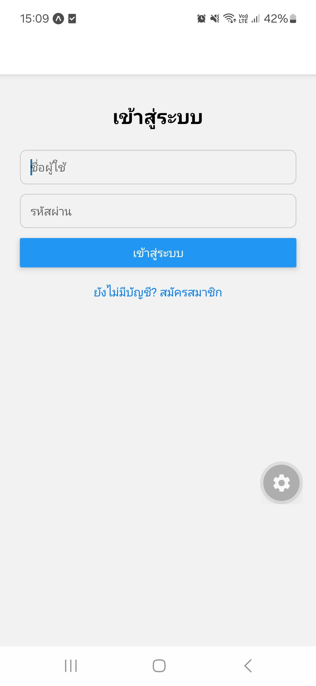

เมื่อเข้าสู่ระบบแล้ว คุณจะเข้าสู่แถบแท็บหลักซึ่งมี 5 แท็บ ได้แก่ **หน้าแรก** (Home), **รายการสินค้า** (Products), **แสกนสินค้า** (Scan), **ประวัติ** (Orders) และ **โปรไฟล์** (Profile)

---

## แท็บหน้าแรก (แดชบอร์ด)

สิ่งที่คุณเห็นในหน้านี้ขึ้นอยู่กับบทบาทของคุณ:

- **พนักงาน / ลูกค้า** จะเห็นหน้าแรกว่างเปล่า (ยังไม่มีอะไรให้ตั้งค่า)
- **เจ้าของร้าน, ผู้ดูแลระบบสูงสุด และผู้จัดการคำสั่งซื้อ** จะเห็น **แดชบอร์ด** ซึ่งประกอบด้วย:
    - ยอดขายวันนี้และยอดขายรวมของเดือนนี้
    - จำนวนคำสั่งซื้อที่รอดำเนินการ / กำลังจัดส่ง / เสร็จสมบูรณ์ (แตะ "รอดำเนินการ" / Pending เพื่อไปยังหน้ารายการคำสั่งซื้อ)
    - รายการ "สินค้าขายดี" (Best sellers) — แตะสินค้าใดก็ได้เพื่อเปิดหน้ารายละเอียด
- **ผู้ใช้ระดับพนักงาน** (ผู้จัดการสินค้า, ผู้จัดการคำสั่งซื้อ, พนักงาน, ผู้จัดการฝ่ายการเงิน, เจ้าของร้าน, ผู้ดูแลระบบสูงสุด) จะเห็นเมนูจัดการ "ฐานข้อมูล" อยู่ในแท็บนี้ด้วย โดยลิงก์จะปรับตามบทบาท ได้แก่ ผู้ใช้งาน/Users (เจ้าของร้าน/ผู้ดูแลระบบสูงสุด), หมวดหมู่สินค้า/Categories (ผู้ใช้ระดับพนักงานทุกคน), รายการสินค้า/Products (ผู้จัดการสินค้า), คำสั่งซื้อ/Orders (ผู้จัดการคำสั่งซื้อ/พนักงาน) และ ประวัติการชำระเงิน/Payment history (ผู้จัดการฝ่ายการเงิน) เมนูนี้เดิมอยู่ในหน้าโปรไฟล์ ตอนนี้ย้ายมาอยู่ที่หน้าแรกแล้ว

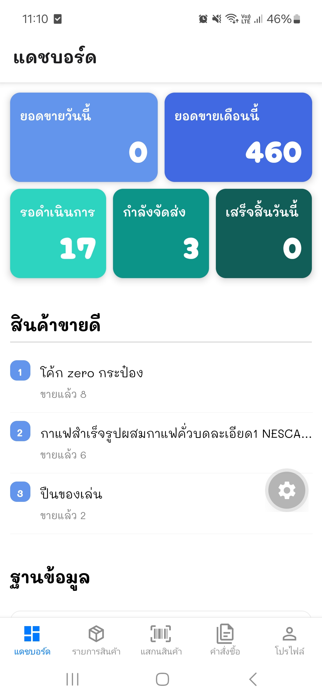
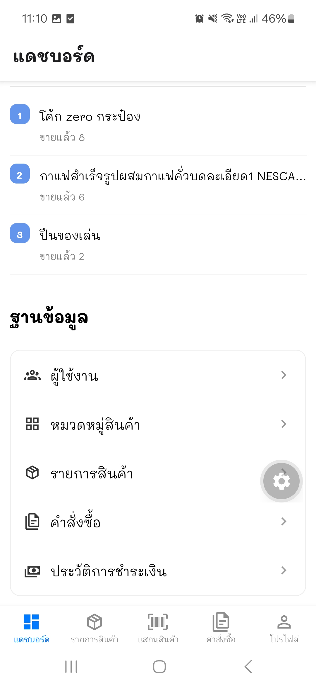

---

## เรียกดูหมวดหมู่และสินค้า

- **รายการสินค้า (แท็บ Products)**: กริดสินค้าทั้งหมดที่สามารถเลื่อนดูได้ พร้อมชื่อและราคา หากคุณเข้ามาจากหมวดหมู่ จะมีชิปตัวกรองแสดงอยู่ด้านบน — แตะ **ล้างตัวกรอง** (Clear filter) เพื่อดูสินค้าทั้งหมดอีกครั้ง
- แตะการ์ดสินค้าใดก็ได้เพื่อเปิด **หน้ารายละเอียดสินค้า** ซึ่งแสดงชื่อ ราคา และบาร์โค้ดของสินค้า

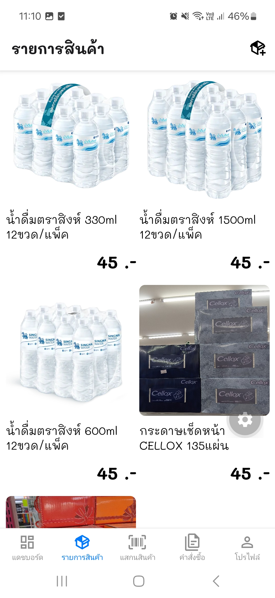
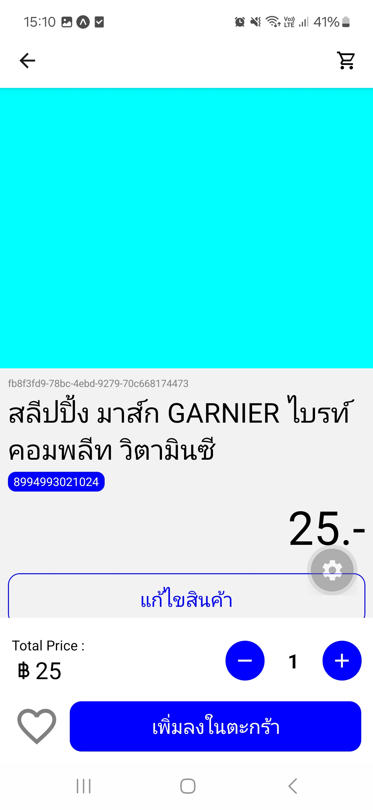

จากหน้ารายละเอียดสินค้า คุณสามารถ:

- ปรับจำนวนด้วยปุ่มเพิ่ม/ลด แล้วแตะ **เพิ่มลงในตะกร้า** (Add to cart) / **อัปเดตตะกร้า** (Update cart) / **ลบออกจากตะกร้า** (Remove from cart)
- แตะไอคอนตะกร้า (มุมขวาบน) เพื่อไปยังตะกร้าสินค้าของคุณโดยตรง

---

## การสแกนบาร์โค้ด

เปิดแท็บ **แสกนสินค้า (Scan)** อนุญาตให้เข้าถึงกล้องหากมีการแจ้งเตือน แล้วส่องกล้องไปที่บาร์โค้ดสินค้า

- **พบสินค้า**: คุณจะถูกนำไปยังหน้ารายละเอียดของสินค้านั้นทันที
- **ไม่พบสินค้า**: จะมีข้อความแจ้งเตือนปรากฏขึ้น พนักงานที่มีสิทธิ์จัดการสินค้าจะได้รับทางลัดให้สร้างสินค้าใหม่ โดยกรอกบาร์โค้ดที่สแกนไว้ล่วงหน้าให้อัตโนมัติ

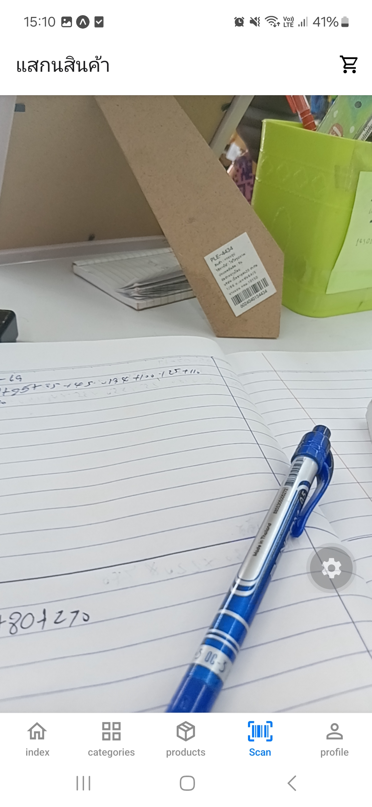

---

## ตะกร้าสินค้าและการชำระเงิน

1. แตะไอคอนตะกร้า (แสดงอยู่บนแถบหัวข้อในแท็บส่วนใหญ่) เพื่อเปิด **ตะกร้าสินค้า** ของคุณ
2. ตรวจสอบรายการสินค้าและยอดรวม จากนั้นแตะ **ยืนยันคำสั่งซื้อ** (Confirm order) เพื่อล็อกราคาปัจจุบัน
3. ราคาที่ล็อกไว้จะมีระยะเวลาจำกัด (แสดงเป็นตัวนับถอยหลัง เช่น `4:59`) หากหมดเวลาก่อนที่คุณจะทำรายการเสร็จ ให้แตะ **ล็อกราคาใหม่** (Re-lock prices) เพื่อรีเฟรชเวลา
4. เลือกหรือเพิ่มที่อยู่จัดส่งในส่วน **ที่อยู่จัดส่ง** (Shipping address)
5. แตะ **ยืนยันคำสั่งซื้อ** (Confirm order) อีกครั้งเพื่อสั่งซื้อ — คุณจะถูกนำไปยังหน้ารายละเอียดของคำสั่งซื้อใหม่

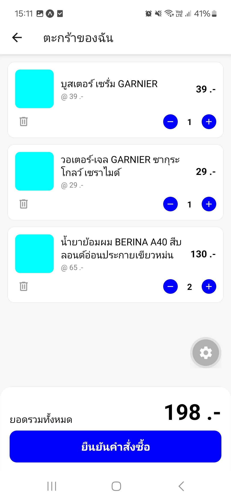
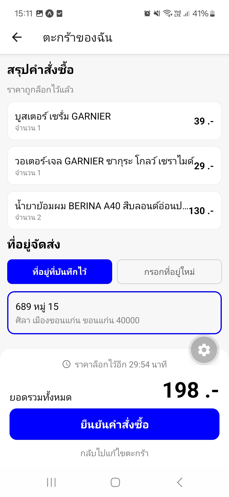

หากตะกร้าว่างเปล่า จะมีข้อความแนะนำให้ไปเลือกดูสินค้าแทน

---

## คำสั่งซื้อของฉัน

เข้าถึงได้ผ่าน **แท็บประวัติ (Orders)** ที่แถบด้านล่าง หรือผ่าน **โปรไฟล์ → คำสั่งซื้อของฉัน** (My orders)

- กรองตามสถานะ: ทั้งหมด / อยู่ระหว่างดำเนินการ (Created) / จัดส่งแล้ว (Shipped) / เสร็จสมบูรณ์ (Completed) / ยกเลิกแล้ว (Cancelled)
- แตะคำสั่งซื้อเพื่อดูรายละเอียดทั้งหมด: รายการสินค้า ยอดรวม เวลาบันทึก และ (ขึ้นอยู่กับบทบาทของคุณ) ปุ่มดำเนินการสถานะหรือการบันทึกการชำระเงิน

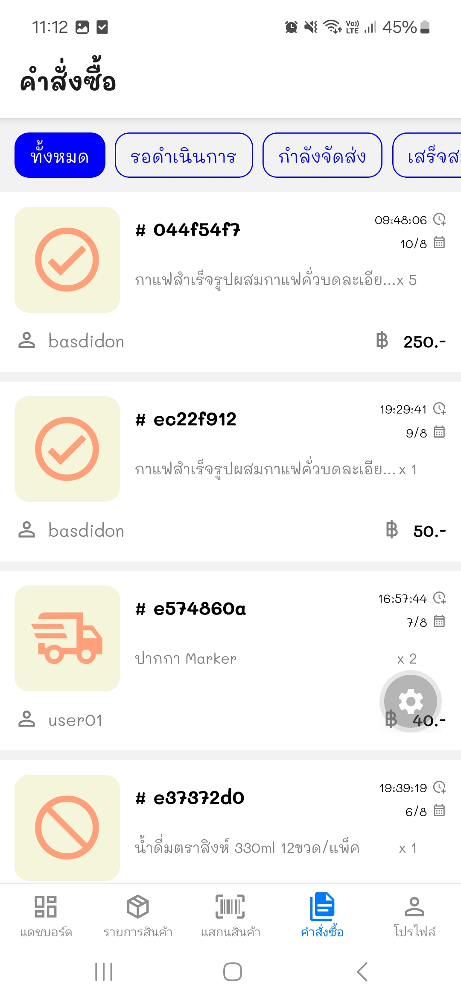
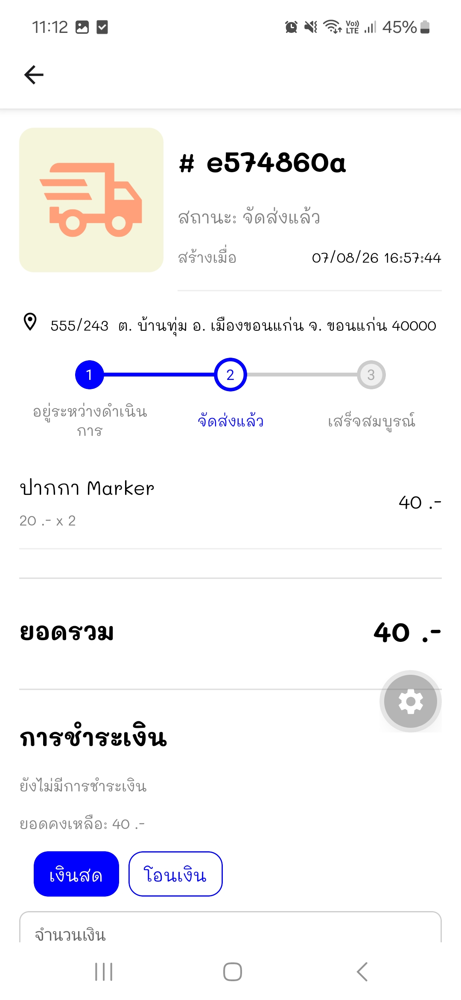

ในหน้ารายละเอียดคำสั่งซื้อ ผู้ใช้ระดับพนักงานอาจสามารถ:

- แก้ไขรายการสินค้า (ทำได้เฉพาะขณะที่คำสั่งซื้อยังอยู่ในสถานะ "อยู่ระหว่างดำเนินการ")
- เปลี่ยนสถานะเป็น **จัดส่งแล้ว**, **เสร็จสมบูรณ์** หรือ **ยกเลิกแล้ว**
- บันทึกหรือยกเลิกการชำระเงินของคำสั่งซื้อนั้น (ดู [การชำระเงิน](#การชำระเงิน))

---

## ที่อยู่ที่บันทึกไว้

เข้าถึงได้ผ่าน **โปรไฟล์ → สถานที่ที่บันทึกไว้** (Saved addresses)

- ดูที่อยู่จัดส่งที่คุณบันทึกไว้
- แตะ **+** ที่แถบหัวข้อเพื่อเพิ่มที่อยู่ใหม่
- แตะไอคอนดินสอเพื่อแก้ไขที่อยู่ หรือไอคอนถังขยะเพื่อลบที่อยู่ (จะมีข้อความยืนยันก่อนลบ)

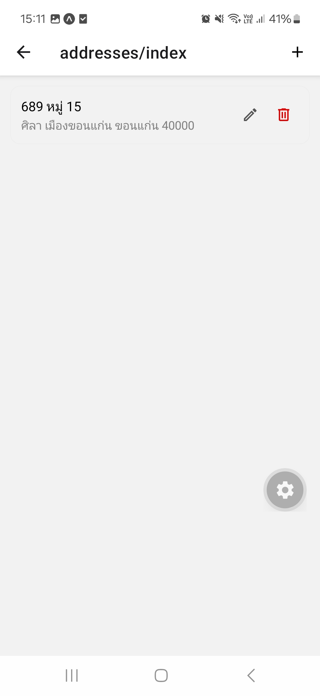

---

## การชำระเงิน

เข้าถึงได้ผ่าน **โปรไฟล์ → การชำระเงินของฉัน / การชำระเงินทั้งหมด** (My payments / All payments — ป้ายกำกับและขอบเขตข้อมูลขึ้นอยู่กับบทบาทของคุณ)

- ผู้ใช้ทั่วไปจะเห็นเฉพาะการชำระเงินของตนเอง
- ผู้จัดการฝ่ายการเงินจะเห็นการชำระเงินทั้งหมดของทุกคำสั่งซื้อ
- แต่ละรายการแสดงชื่อผู้ใช้ของลูกค้า จำนวนเงิน วิธีชำระเงิน (เงินสด/Cash หรือ โอนจ่าย/Bank transfer) และลิงก์กลับไปยังคำสั่งซื้อที่เกี่ยวข้อง รายการที่ถูกยกเลิกจะแสดงเป็นสีจาง

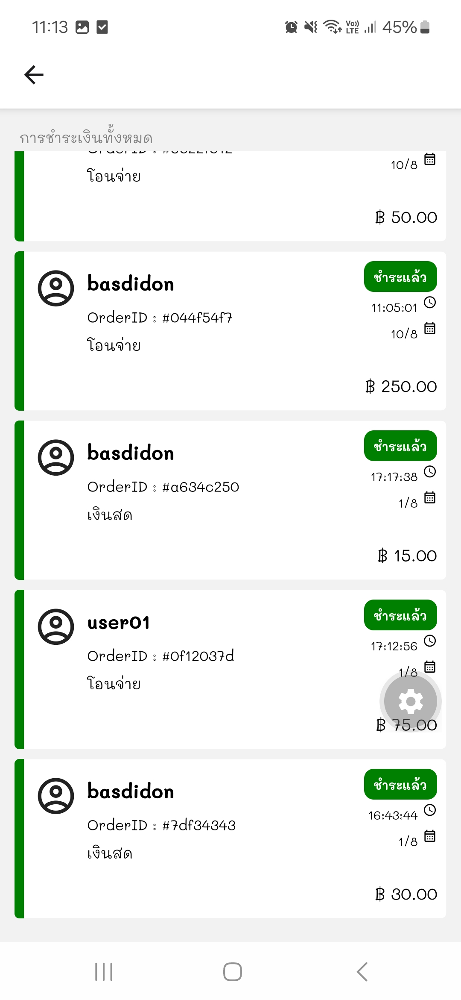

---

## โปรไฟล์

เข้าถึงได้ผ่านแท็บ **โปรไฟล์ (Profile)** แสดงชื่อผู้ใช้ รหัสผู้ใช้ และป้ายบทบาท พร้อมเมนูที่ปรับเปลี่ยนตามสิทธิ์ของคุณ:

- **เฉพาะพนักงาน (Staff only)** _(ผู้ใช้ระดับพนักงานทุกบทบาท)_ — ลิงก์สลับหน้าเดียว ให้เปลี่ยนไปมาระหว่างหน้าร้านและหลังร้าน: **ไปหน้าร้าน** (Go to storefront) เมื่อคุณอยู่ในหลังร้าน หรือ **จัดการหลังร้าน** (Go to backstore) เมื่อคุณอยู่ในหน้าร้าน (ลิงก์จัดการหมวดหมู่/สินค้า/คำสั่งซื้อ/ผู้ใช้งาน ย้ายไปอยู่ที่แท็บหน้าแรกของหลังร้านแล้ว — ดู [แท็บหน้าแรก (แดชบอร์ด)](#แท็บหน้าแรก-แดชบอร์ด))
- **ทั่วไป (General)** — คำสั่งซื้อของฉัน, ที่อยู่ที่บันทึกไว้, การชำระเงินของฉัน
- **เกี่ยวกับ (About)** — ข้อมูลแอป
- **ออกจากระบบ (Log out)** อยู่ด้านล่างสุด พร้อมข้อความยืนยันก่อนออก

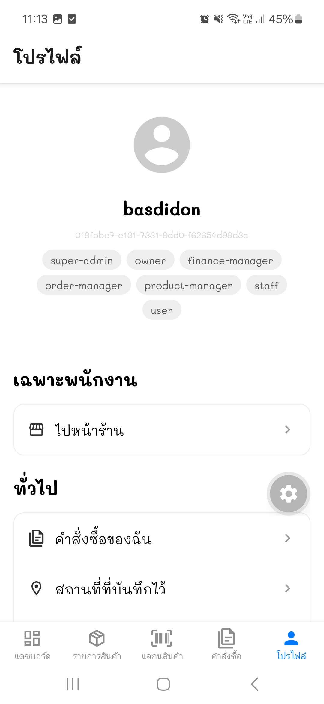
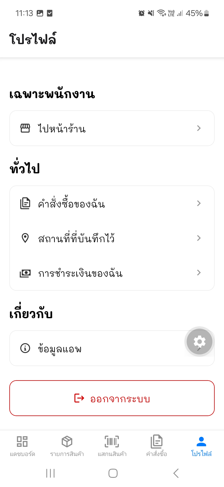

---

## บทบาทและสิทธิ์การใช้งาน

แอปจะปรับสิ่งที่คุณเห็นตามบทบาทที่ได้รับมอบหมาย ผู้ใช้ระดับพนักงานทุกบทบาทจะเข้าถึงพื้นที่หลังร้านแยกต่างหาก (เครื่องมือจัดการ, แถบแท็บของตัวเอง) นอกเหนือจากหน้าร้านปกติ — สลับไปมาได้ผ่านลิงก์ในหน้า [โปรไฟล์](#โปรไฟล์)

| บทบาท                                                     | สามารถทำอะไรได้บ้าง                                                           |
| --------------------------------------------------------- | ----------------------------------------------------------------------------- |
| ลูกค้า (ไม่มีบทบาทพิเศษ)                                  | เรียกดูสินค้า, สแกน, ซื้อสินค้า, จัดการที่อยู่/การชำระเงิน/คำสั่งซื้อของตนเอง |
| `staff` (พนักงาน)                                         | ดู/จัดการคำสั่งซื้อที่ได้รับมอบหมาย, เพิ่มสินค้าลงในคำสั่งซื้อ                |
| `order-manager` (ผู้จัดการคำสั่งซื้อ)                     | จัดการรายการสินค้าและสถานะคำสั่งซื้อ (จัดส่ง/เสร็จสมบูรณ์/ยกเลิก)             |
| `finance-manager` (ผู้จัดการฝ่ายการเงิน)                  | บันทึกและยกเลิกการชำระเงิน, ดูการชำระเงินทั้งหมด                              |
| `product-manager` (ผู้จัดการสินค้า)                       | จัดการหมวดหมู่, สร้าง/แก้ไขสินค้า                                             |
| `owner` / `super-admin` (เจ้าของร้าน / ผู้ดูแลระบบสูงสุด) | เข้าถึงได้ทั้งหมด รวมถึงแดชบอร์ดและรายการผู้ใช้                               |

บทบาทสามารถรวมกันได้ — เช่น เจ้าของร้านจะเห็นทั้งแดชบอร์ด เครื่องมือจัดการสินค้า การจัดการคำสั่งซื้อ และรายการผู้ใช้ทั้งหมดพร้อมกัน
